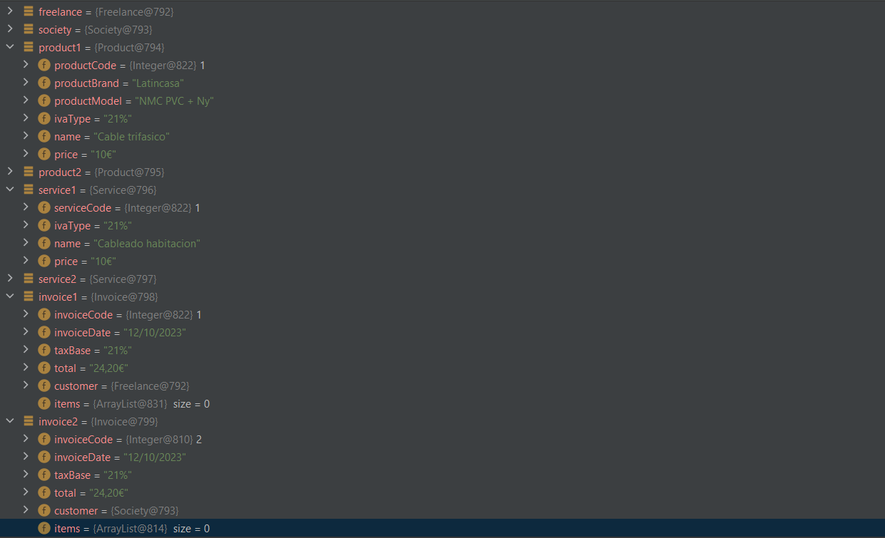

## Description de la tarea

Digitalizacion de una empresa de electricidad. Además se han creado datos de prueba.

## ¿Cómo se ha implementado?

Se ha modelado cada una de las entidades que hay en el negocio

## Keywords

Diagrama de clase, atributos, métodos, herencias, main, debug, breakpoint.

## Screenshots or Video

